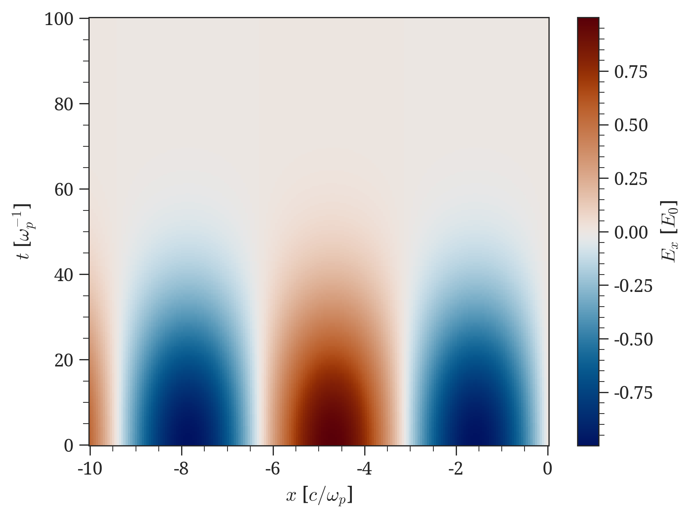
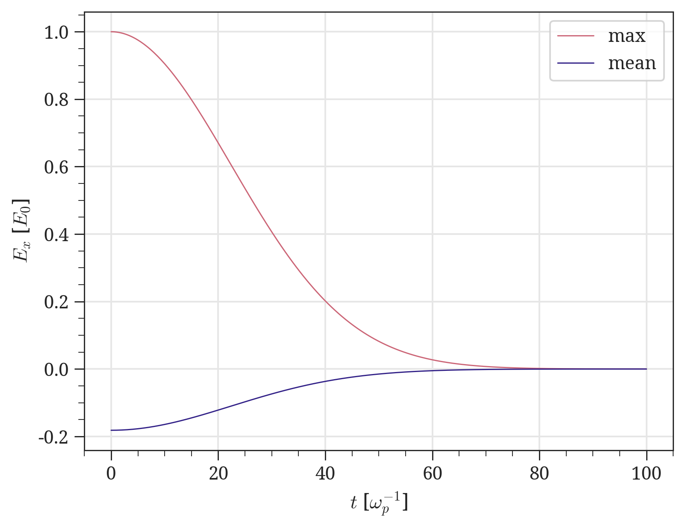

# Getting started

Ozzy's main strength is that it is built on the [xarray][] package. The logic behind xarray (and therefore ozzy) consists of handling numerical data as a "package" that includes the axis information and other metadata besides the actual data itself (similarly to the HDF5 file format, for example), as opposed to a simple array with numbers. This package can take the form of either a DataArray or a Dataset (see [*Data objects* in *Key concepts*](../key-concepts.md#data-objects) for more details).

Once a file has been read by ozzy and translated from a simulation file into a data object, we can take advantage of xarray's vast repertoire of built-in methods and functions. This generally includes all the operations that you would otherwise perform on a [NumPy][numpy] array (an [`ndarray`][numpy.ndarray]), as well as [xarray's plotting shortcuts](https://docs.xarray.dev/en/stable/user-guide/plotting.html).


!!! example annotate "Quick example"

    Let's construct some sample data of an oscillating electric field whose amplitude decreases along time. 

    ```python
    import matplotlib.pyplot as plt
    import numpy as np
    import ozzy as oz
    import ozzy.plot

    # Create some sample data
    t = np.linspace(0, 100, 300)
    x = np.linspace(-10, 0, 200)
    Ex = np.outer(np.exp(-0.001 * t**2), np.sin(x))

    # Create a data object (in this case a DataArray)
    da = oz.DataArray(
        Ex,
        dims=["t", "x"],
        coords={"t": t, "x": x},
        name="Ex",
        attrs={"long_name": r"$E_x$", "units": r"$E_0$"},  #(1)!
    )
    da["t"] = da["t"].assign_attrs(long_name=r"$t$", units=r"$\omega_p^{-1}$")
    da["x"] = da["x"].assign_attrs(long_name=r"$x$", units=r"$c / \omega_p$")

    # Take maximum and median of data
    da_max = da.max(dim="x")  #(2)!
    da_mean = da.mean(dim="x")  #(3)!

    # Plot - initial data
    plt.subplots()
    da.plot()
    plt.show()

    # Plot - max and mean
    plt.subplots()
    da_max.plot(label="max")
    da_mean.plot(label="mean")
    plt.grid()
    plt.legend()
    plt.show()

    # Save result as a Dataset
    ds_out = oz.Dataset(
        {"Ex_max": da_max, "Ex_mean": da_mean},
        pic_data_type="grid", 
        data_origin="ozzy"
    )
    ds_out.ozzy.save("Ex_max_mean.h5")
    ```

    We've taken the maximum and mean values along the spatial dimension $x$ for each time $t$, and plotted the result. The generated plots look like this:

    <figure markdown="span">
        { width="400" }
        <figcaption>Initial field data</figcaption>
    </figure>

    <figure markdown="span">
        { width="400" }
        <figcaption>Maximum and mean along $t$</figcaption>
    </figure>


1.  The `'long_name'` and `'units'` attributes are automatically used by xarray to label plots.
2.  See [xarray.DataArray.max][]. Note that the result is again a [DataArray](../key-concepts.md#DataArray).
3.  See [xarray.DataArray.mean][]. Note that the result is again a [DataArray](../key-concepts.md#DataArray).


Explore the examples below to better understand how ozzy works:

:material-arrow-right: [Subtract two field components](subtract-two-field-components.md)

:material-arrow-right: [Phase space and histograms from particle data](phase-space.md)

:material-arrow-right: [Charge density from particle data](charge-density.md)

